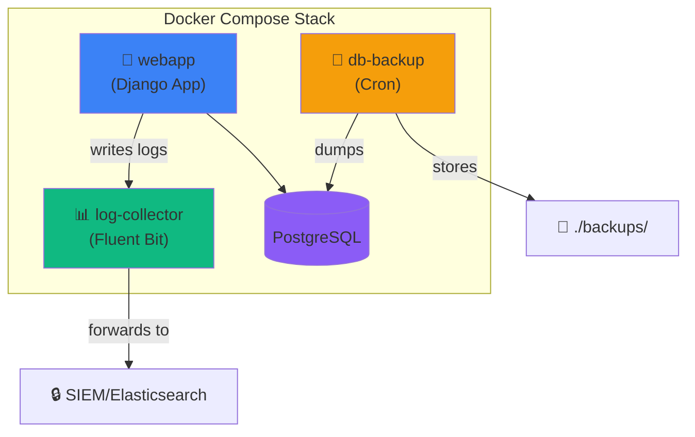
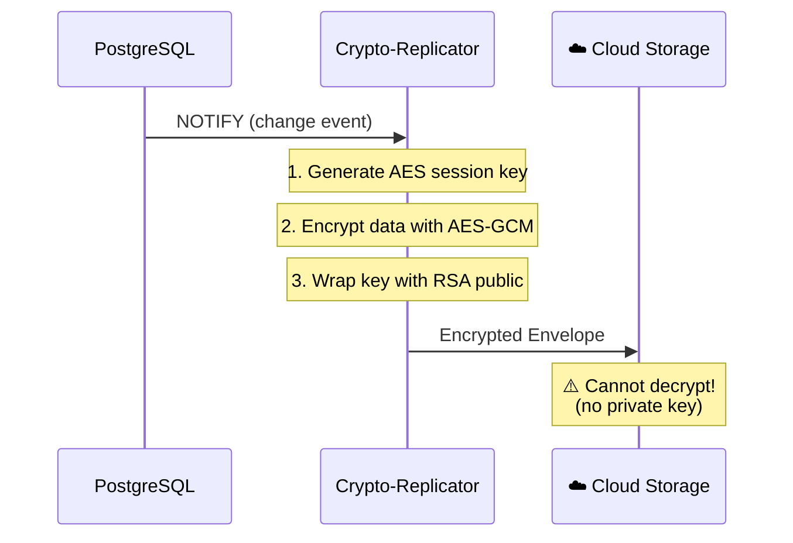

# NIS2 Infrastructure Kit

[](https://opensource.org/licenses/MIT)
[](https://www.docker.com/)

**Secure-by-Design Docker Infrastructure for NIS2 Compliance.**

This repository provides the "last mile" for NIS2 compliance: **secure infrastructure**. While [django-nis2-shield](https://github.com/nis2shield/django-nis2-shield) and [@nis2shield/react-guard](https://github.com/nis2shield/react-guard) protect your code, this kit protects the **execution environment**.

## ✨ Features

- 🔒 **Hardened Containers**: Non-root execution, read-only filesystem
- 📊 **Log Segregation**: Logs exported via sidecar (Fluent Bit)
- 💾 **Automated Backups**: PostgreSQL dumps with retention policy
- 🏗️ **NIS2 Compliant**: Addresses Art. 21 infrastructure requirements

## 📋 Architecture

### Base Stack



### Security Features

| Component | Protection |
|-----------|------------|
| webapp | Non-root, read-only filesystem, tmpfs |
| log-collector | Read-only log access, SIEM forwarding |
| db-backup | 7-day retention, optional GPG encryption |
| PostgreSQL | Dedicated volume, health checks |

---

### 🔐 Encrypted Twin (Disaster Recovery)

The **Crypto-Replicator** provides zero-trust cloud backup:



**Key Features:**
- 🔒 **AES-256-GCM** - Authenticated data encryption
- 🔑 **RSA-OAEP** - Asymmetric key wrapping
- 🔄 **Forward Secrecy** - Unique session key per message
- ☁️ **Zero-Trust Cloud** - Cloud cannot read your data

## 🚀 Quick Start

### Prerequisites

- Docker & Docker Compose v2+
- A Docker image of your Django app using `django-nis2-shield`

### Installation

```bash
# Clone the repository
git clone https://github.com/nis2shield/infrastructure.git
cd infrastructure

# Copy environment template
cp .env.example .env

# Edit .env with your values (IMPORTANT: change passwords!)
nano .env

# Start the stack
docker-compose up -d

# Check status
docker-compose ps
```

## ⚙️ Services

### 1. webapp (Application Layer)

Your Django application, hardened with:
- `user: 1000:1000` - Non-root execution
- `read_only: true` - Immutable filesystem
- `tmpfs: /tmp` - RAM-only writable directory

### 2. log-collector (Fluent Bit Sidecar)

Reads logs from shared volume and forwards to:
- **Console** (default, for development)
- **Elasticsearch** (uncomment in config)
- **HTTP/SIEM** (Intrusa, Splunk HEC, etc.)

Edit `monitoring/fluent-bit.conf` to configure outputs.

### 3. db-backup (Business Continuity)

Automated PostgreSQL backups:
- Schedule: `@every 6h00m` (configurable)
- Retention: 7 days (configurable)
- Location: `./backups/`

## 🔄 Disaster Recovery Testing

Test that your backups can be restored (NIS2 Art. 21c requirement):

```bash
# Run the automated restore test
./scripts/restore-test.sh

# Or specify a backup file
./scripts/restore-test.sh ./backups/mybackup.sql.gz
```

The script will:
1. Start an empty PostgreSQL container
2. Restore the latest backup
3. Validate the data integrity
4. Generate a compliance report

Keep the generated report for your NIS2 audit documentation.

## 📊 ELK Stack (Elasticsearch + Kibana)

Visualize your NIS2 logs in a beautiful dashboard:

```bash
# Quick setup (starts ES + Kibana + configures index)
./scripts/elk-setup.sh

# Or manually
docker-compose -f docker-compose.yml -f docker-compose.elk.yml up -d
```

Once running:
- **Kibana**: http://localhost:5601
- **Elasticsearch**: http://localhost:9200

Go to Kibana → Analytics → Discover → Select "NIS2 Logs" to see your logs.

> **Note**: ELK requires ~1.5GB RAM. Use the base stack for low-memory systems.

## 📈 Prometheus + Grafana Monitoring

Real-time metrics and NIS2 compliance dashboard:

```bash
# Quick setup
./scripts/monitoring-setup.sh

# Or manually
docker-compose -f docker-compose.yml -f docker-compose.monitoring.yml up -d
```

Access:
- **Grafana**: http://localhost:3000 (admin/admin)
- **Prometheus**: http://localhost:9090

Pre-configured NIS2 dashboard includes:
- Request rate and error percentage
- Backup age monitoring
- System resource usage

## 📁 Project Structure

```
infrastructure/
├── docker-compose.yml              # Base stack (5 services)
├── docker-compose.prod.yml         # Production overrides
├── docker-compose.elk.yml          # ELK observability
├── docker-compose.monitoring.yml   # Prometheus + Grafana
├── docker-compose.test.yml         # Integration testing
│
├── crypto-replicator/              # 🔐 Encrypted Twin service
│   ├── crypto_replicator/          # Python modules
│   │   ├── crypto.py               # AES + RSA encryption
│   │   ├── listener.py             # PostgreSQL CDC
│   │   └── sender.py               # Cloud API client
│   ├── mock_cloud/                 # Test receiver
│   ├── tests/                      # Unit + integration tests
│   ├── Dockerfile
│   └── README.md
│
├── monitoring/
│   ├── fluent-bit.conf             # Default log config
│   ├── prometheus.yml              # Prometheus config
│   ├── alert_rules.yml             # NIS2 alerts
│   └── grafana/                    # Dashboards + datasources
│
├── scripts/
│   ├── restore-test.sh             # DR validation (GPG support)
│   ├── elk-setup.sh                # ELK quick start
│   └── monitoring-setup.sh         # Grafana quick start
│
└── examples/                       # Sample Django setup
```

## 🔐 NIS2 Compliance Matrix

| NIS2 Article | Requirement | Infrastructure Solution |
|--------------|-------------|------------------------|
| Art. 21 (a) | Risk analysis & system security | Hardened containers, non-root |
| Art. 21 (b) | Incident management | Centralized, segregated logs |
| Art. 21 (c) | Business continuity | Automated backups with retention |
| Art. 21 (d) | Supply chain security | Verified base images |
| Art. 21 (e) | Security hygiene | Read-only filesystem |

## 🔧 Configuration

### SIEM Integration

Edit `monitoring/fluent-bit.conf`:

```ini
# Uncomment for Elasticsearch
[OUTPUT]
    Name              es
    Host              ${ELASTICSEARCH_HOST}
    Port              9200
    Index             nis2-logs
```

### Backup Schedule

In `docker-compose.yml` or `.env`:

```yaml
SCHEDULE=@every 6h00m   # Every 6 hours
BACKUP_KEEP_DAYS=7      # Keep 7 days
```

## 🤝 Related Projects

- [django-nis2-shield](https://github.com/nis2shield/django-nis2-shield) - Backend middleware
- [@nis2shield/react-guard](https://github.com/nis2shield/react-guard) - Frontend protection
- [nis2shield.com](https://nis2shield.com) - Documentation hub

## 📄 License

MIT License - see [LICENSE](LICENSE) for details.

## 🙋 Contributing

Contributions welcome! See [CONTRIBUTING.md](CONTRIBUTING.md).

---

**Part of the [NIS2 Shield](https://nis2shield.com) ecosystem** 🛡️