# NIS2 Infrastructure Kit

[](https://opensource.org/licenses/MIT)
[](https://www.docker.com/)
[](./charts/nis2shield)
[](./terraform)
[](https://gitpod.io/#https://github.com/nis2shield/infrastructure)

**Secure-by-Design Infrastructure for NIS2 Compliance.**

This repository provides the "last mile" for NIS2 compliance: **secure infrastructure**. Deploy with Docker Compose, Helm (Kubernetes), or Terraform (Cloud). While [django-nis2-shield](https://github.com/nis2shield/django-nis2-shield), [nis2-spring-shield](https://github.com/nis2shield/nis2-spring-shield), and [@nis2shield/react-guard](https://github.com/nis2shield/react-guard) protect your code, this kit protects the **execution environment**.

> **🎉 Now supports both Django and Spring Boot applications!** Same JSON log format, same infrastructure.

## ✨ Features

- 🔒 **Hardened Containers**: Non-root execution, read-only filesystem
- 📊 **Log Segregation**: Logs exported via sidecar (Fluent Bit)
- 💾 **Automated Backups**: PostgreSQL dumps with retention policy
- 🔐 **Encrypted Twin**: Zero-trust cloud backup (AES-256 + RSA)
- 🛡️ **Compliance Engine**: Automated `tfsec` & `gitleaks` checks in CI/CD
- 📈 **Dynamic Reporting**: Updates `NIS2_SELF_ASSESSMENT.md` automatically
- ☸️ **Kubernetes Ready**: Production Helm chart with NetworkPolicies
- ☁️ **Multi-Cloud**: Terraform modules for AWS, GCP, Azure
- 🏗️ **NIS2 Compliant**: Addresses Art. 21 infrastructure requirements

## 📋 Architecture

### Base Stack

```mermaid
graph TB
    subgraph Docker["Docker Compose Stack"]
        webapp["🐍/☕ webapp<br/>(Django or Spring Boot)"]
        logs["📊 log-collector<br/>(Fluent Bit)"]
        backup["💾 db-backup<br/>(Cron)"]
        db[(PostgreSQL)]
        
        webapp --> |writes logs| logs
        webapp --> db
        backup --> |dumps| db
    end
    
    logs --> |forwards to| SIEM["🔒 SIEM/Elasticsearch"]
    backup --> |stores| Storage["📁 ./backups/"]
    
    style webapp fill:#3b82f6
    style logs fill:#10b981
    style backup fill:#f59e0b
    style db fill:#8b5cf6
```



> **Note**: The JSON log format is identical for both Django and Spring Boot applications, ensuring seamless interoperability.

### Security Features

| Component | Protection |
|-----------|------------|
| webapp | Non-root, read-only filesystem, tmpfs |
| log-collector | Read-only log access, SIEM forwarding |
| db-backup | 7-day retention, optional GPG encryption |
| PostgreSQL | Dedicated volume, health checks |

---

### 🔐 Encrypted Twin (Disaster Recovery)

The **Crypto-Replicator** provides zero-trust cloud backup:

```mermaid
sequenceDiagram
    participant DB as PostgreSQL
    participant CR as Crypto-Replicator
    participant Cloud as ☁️ Cloud Storage
    
    DB->>CR: NOTIFY (change event)
    
    Note over CR: 1. Generate AES session key
    Note over CR: 2. Encrypt data with AES-GCM
    Note over CR: 3. Wrap key with RSA public
    
    CR->>Cloud: Encrypted Envelope
    
    Note over Cloud: ⚠️ Cannot decrypt!<br/>(no private key)
```



**Key Features:**
- 🔒 **AES-256-GCM** - Authenticated data encryption
- 🔑 **RSA-OAEP** - Asymmetric key wrapping
- 🔄 **Forward Secrecy** - Unique session key per message
- ☁️ **Zero-Trust Cloud** - Cloud cannot read your data

### 🛡️ The Truth vs The Proof

This infrastructure is designed to support the **NIS2Shield** business model:

1.  **The Truth (Open Source)**:
    *   **Secure Infrastructure**: All the Docker/Helm/Terraform code in this repo is free and MIT licensed.
    *   **Static Guardrails**: We provide configs for `tfsec` and `gitleaks` to block insecurity in CI/CD.
    *   **Self-Assessment**: The manual [docs/NIS2_SELF_ASSESSMENT.md](docs/NIS2_SELF_ASSESSMENT.md) checklist.

2.  **The Proof (Auditor Kit - Commercial)**:
    *   **Compliance Engine**: The proprietary binary that connects to this infrastructure.
    *   **Automated Reporting**: It parses the logs generated by these containers to verify operational requirements (e.g., "Did backups run?").
    *   **Legal PDF**: Automatically generates the signed report for your auditor.

> **Note**: This repository contains "The Truth" (the secure runtime). To get the automated "Proof" (Compliance Engine & Reports), see cur **[Pro Auditor Kit](https://nis2shield.com/pricing)**.

## 🚀 Quick Start


### Prerequisites

- Docker & Docker Compose v2+
- A Docker image of your application using:
  - **Django**: [django-nis2-shield](https://github.com/nis2shield/django-nis2-shield)
  - **Spring Boot**: [nis2-spring-shield](https://github.com/nis2shield/nis2-spring-shield)

### Installation

```bash
# Clone the repository
git clone https://github.com/nis2shield/infrastructure.git
cd infrastructure

# Copy environment template
cp .env.example .env

# Edit .env with your values (IMPORTANT: change passwords!)
nano .env

# Start the stack
docker-compose up -d

# Check status
docker-compose ps
```

## ⚙️ Services

### 1. webapp (Application Layer)

Your Django or Spring Boot application, hardened with:
- `user: 1000:1000` - Non-root execution
- `read_only: true` - Immutable filesystem
- `tmpfs: /tmp` - RAM-only writable directory

> **Spring Boot**: See `examples/docker-compose.spring.yml` for a Spring-specific example.

### 2. log-collector (Fluent Bit Sidecar)

Reads logs from shared volume and forwards to:
- **Console** (default, for development)
- **Elasticsearch** (uncomment in config)
- **HTTP/SIEM** (Intrusa, Splunk HEC, etc.)

Edit `monitoring/fluent-bit.conf` to configure outputs.

### 3. db-backup (Business Continuity)

Automated PostgreSQL backups:
- Schedule: `@every 6h00m` (configurable)
- Retention: 7 days (configurable)
- Location: `./backups/`

## 🔄 Disaster Recovery Testing

Test that your backups can be restored (NIS2 Art. 21c requirement):

```bash
# Run the automated restore test
./scripts/restore-test.sh

# Or specify a backup file
./scripts/restore-test.sh ./backups/mybackup.sql.gz
```

The script will:
1. Start an empty PostgreSQL container
2. Restore the latest backup
3. Validate the data integrity
4. Generate a compliance report

Keep the generated report for your NIS2 audit documentation.

## 📊 ELK Stack (Elasticsearch + Kibana)

Visualize your NIS2 logs in a beautiful dashboard:

```bash
# Quick setup (starts ES + Kibana + configures index)
./scripts/elk-setup.sh

# Or manually
docker-compose -f docker-compose.yml -f docker-compose.elk.yml up -d
```

Once running:
- **Kibana**: http://localhost:5601
- **Elasticsearch**: http://localhost:9200

Go to Kibana → Analytics → Discover → Select "NIS2 Logs" to see your logs.

> **Note**: ELK requires ~1.5GB RAM. Use the base stack for low-memory systems.

## 📈 Prometheus + Grafana Monitoring

Real-time metrics and NIS2 compliance dashboard:

```bash
# Quick setup
./scripts/monitoring-setup.sh

# Or manually
docker-compose -f docker-compose.yml -f docker-compose.monitoring.yml up -d
```

Access:
- **Grafana**: http://localhost:3000 (admin/admin)
- **Prometheus**: http://localhost:9090

Pre-configured NIS2 dashboard includes:
- Request rate and error percentage
- Backup age monitoring
- System resource usage

## ☸️ Kubernetes (Helm Chart)

For enterprise deployments, use our production-ready Helm chart:

```bash
# Install from local
helm install nis2shield ./charts/nis2shield -n nis2 --create-namespace

# With custom values
helm install nis2shield ./charts/nis2shield -f values-prod.yaml
```

Features:
- 🔒 Security hardening (PSS restricted, runAsNonRoot)
- 🌐 Ingress with TLS support
- 🔐 NetworkPolicies for service isolation
- ⚙️ Toggle modules (replicator, monitoring)

👉 **[Enterprise Deployment Guide](https://nis2shield.com/enterprise/)**

## ☁️ Cloud Deployment (Terraform)

Infrastructure-as-Code for major cloud providers:

| Provider | Resources | Command |
|----------|-----------|--------|
| **AWS** | VPC, EKS, RDS, S3, KMS | `cd terraform/aws && terraform apply` |
| **GCP** | VPC, GKE, Cloud SQL, Storage | `cd terraform/gcp && terraform apply` |
| **Azure** | VNet, AKS, PostgreSQL, KeyVault | `cd terraform/azure && terraform apply` |

All modules include:
- Encrypted databases with managed keys
- Private networking (no public IPs)
- Secrets management integration
- High availability options

## 📁 Project Structure

```
infrastructure/
├── charts/nis2shield/              # ☸️ Helm Chart (K8s)
│   ├── Chart.yaml
│   ├── values.yaml
│   └── templates/                  # Deployments, Services, etc.
│
├── terraform/                      # ☁️ Cloud IaC
│   ├── aws/                        # VPC, EKS, RDS, S3
│   ├── gcp/                        # VPC, GKE, Cloud SQL
│   └── azure/                      # VNet, AKS, PostgreSQL
│
├── docker-compose.yml              # Base stack
├── docker-compose.prod.yml         # Production overrides
├── docker-compose.elk.yml          # ELK observability
├── docker-compose.monitoring.yml   # Prometheus + Grafana
│
├── crypto-replicator/              # 🔐 Encrypted Twin
│   ├── crypto_replicator/          # Python modules
│   ├── docs/                       # OpenAPI spec
│   └── tests/                      # Unit + integration
│
├── monitoring/                     # Fluent Bit, Prometheus
└── scripts/                        # Setup & DR testing
```

## 🔐 NIS2 Compliance Matrix

| NIS2 Article | Requirement | Infrastructure Solution |
|--------------|-------------|------------------------|
| Art. 21 (a) | Risk analysis & system security | Hardened containers, non-root |
| Art. 21 (b) | Incident management | Centralized, segregated logs |
| Art. 21 (c) | Business continuity | Automated backups with retention |
| Art. 21 (d) | Supply chain security | Verified base images |
| Art. 21 (e) | Security hygiene | Read-only filesystem |

## 🔧 Configuration

### SIEM Integration

Edit `monitoring/fluent-bit.conf`:

```ini
# Uncomment for Elasticsearch
[OUTPUT]
    Name              es
    Host              ${ELASTICSEARCH_HOST}
    Port              9200
    Index             nis2-logs
```

### Backup Schedule

In `docker-compose.yml` or `.env`:

```yaml
SCHEDULE=@every 6h00m   # Every 6 hours
BACKUP_KEEP_DAYS=7      # Keep 7 days
```

## 🤝 Related Projects

- [django-nis2-shield](https://github.com/nis2shield/django-nis2-shield) - Django middleware for NIS2 compliance
- [nis2-spring-shield](https://github.com/nis2shield/nis2-spring-shield) - Spring Boot starter for NIS2 compliance ✨ NEW
- [@nis2shield/react-guard](https://github.com/nis2shield/react-guard) - Frontend protection
- [nis2shield.com](https://nis2shield.com) - Documentation hub

## 📄 License

MIT License - see [LICENSE](LICENSE) for details.

## 🙋 Contributing

Contributions welcome! See [CONTRIBUTING.md](CONTRIBUTING.md).

---

**Part of the [NIS2 Shield](https://nis2shield.com) ecosystem** 🛡️